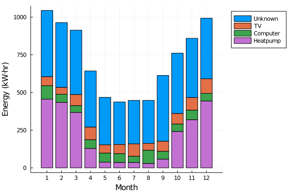

# EmonCMS

Julia package to extract data from an [emonPi](https://guide.openenergymonitor.org/setup/install/) system and store it for offline processing.

## Setup

To set up a new database:

```julia
ds = EmonDataSet("/path/to/existing/dir", "http://emonpi/emoncms/feed", "32-character-api-read-key")
update(ds;feeds=[1,4,6,7,8,14,16,18,20,22,24,26])
```

Here, `emonpi` is the IP address of your emonpi, and the api key (read access is sufficient) is available at http://emonpi/emoncms/feed/api
The `feeds` argument to `update` is needed only during initial setup to specify the feed ids to download.

## Loading and updating

Once the database is initialized, it can be loaded using:

```julia
ds = EmonDataSet("/path/to/existing/dir")
```

To append the latest data to this database, use `update(db)`.

## Analyzing the data

Getting the daily energy usage of a feed named `HeatPump`:

```julia
heatpumpfeed = getfeed(ds, "HeadPump")
energytable = energyperperiod(heatpumpfeed, Day(1))
```

Both `heatpumpfeed` and `energytable` are [JuliaDB](https://juliadb.juliadata.org) tables, available for further processing in e.g. a [Pluto](https://github.com/fonsp/Pluto.jl) notebook.

## Summarizing data

Suppose we have measured data spanning the years 2018, 2019 and 2020, and we want to get the average electricity usage for each month over the years measured. First, we load the packages and data (in the `emondata` dir here):

```julia
using EmonCMS, StatsPlots, Unitful

ds = EmonDataSet("./emondata")
```

Let's say we are interested in the following feeds:

```julia
feeds = ["TV", "Computer", "Heatpump", "L1_in", "L2_in", "L3_in"]
```

The feeds `Li_in` contain the total power usage for each phase in a three-phase setup. To get your monthly summary, we do:

```julia
names,energies,counts = energysummary(ds;
  feeds=feeds,
  years=2018:2020,
  totalpowerfeeds=["L1_in", "L2_in", "L3_in"]
)
```

We can visualize this using a stacked bar plot from `StatsPlots`:

```julia
groupedbar(
	ustrip.(u"kW*hr",energies),
	labels=names,
	bar_position = :stack,
	legend=:outertopright,
	xticks=1:12,
	ylabel="Energy (kW⋅hr)",
	xlabel="Month"
)
```

This results in a monthly overview of the average energy usage per feed:



The feed `Unknown` that has appeared is obtained by subtracting the sum of all known feeds except those passed as `totalpowerfeeds` from the sum of the `totalpowerfeeds`, ensuring that the sum of the feeds in `energies` is always equal to the total energy usage.

We could easily make this a weekly overview by adding the `period` keyword argument to the `energysummary` function:

```julia
names,energies,counts = energysummary(ds;
  feeds=feeds,
  years=2018:2020,
  totalpowerfeeds=["L1_in", "L2_in", "L3_in"],
  period=Week(1)
)
```
